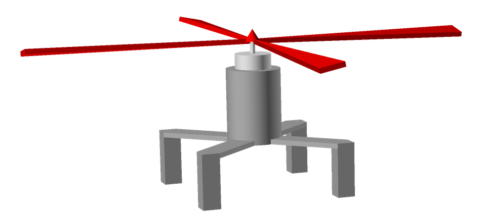

# Monocopter Simulator

This project is for training PID controller in the 1-d drone(monocopter).

Language : javascript, react

## Monocopter description

This monocopter flys up and down.

The goal is hovering at a certain height(Z).

Several controllers controls the monocopter to hover.

## Controllers

### Base Controller

This controller is actually not a controller.

However base controller helps you understanding how the simulator works.

### Open Controller

You can calculate the necessary Force to make the drone hover.

Implement the open loop controller.

### PID Controller

Study the problem of open loop controller.

Implement P, PD, PID controller.

## Video
- https://www.youtube.com/watch?v=YEYejmU1KlI

